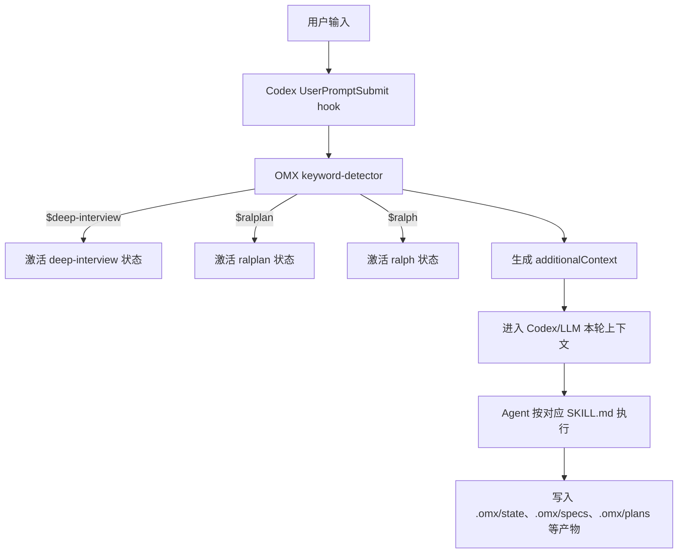
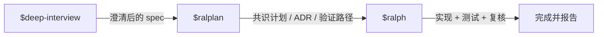
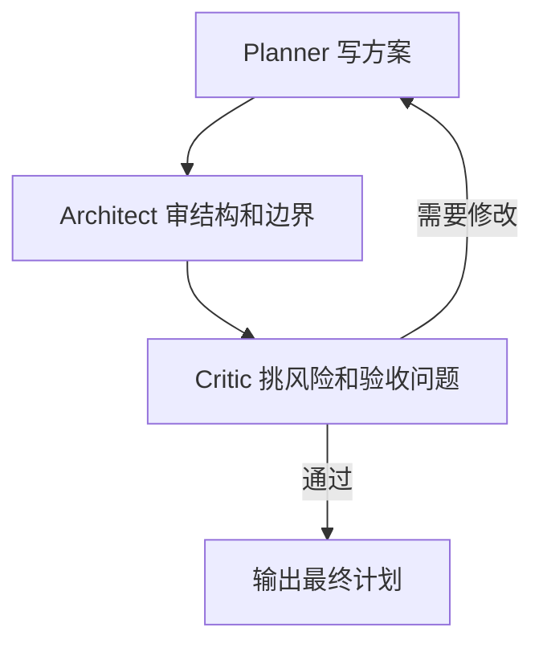
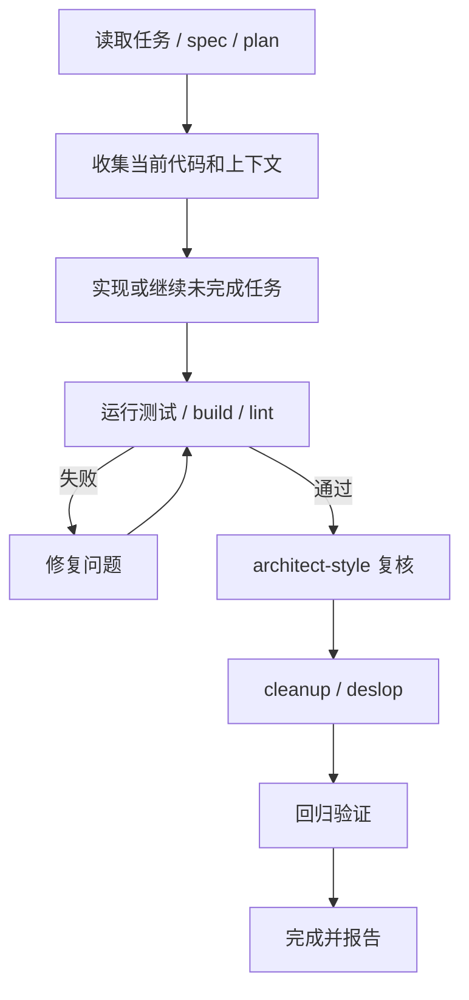
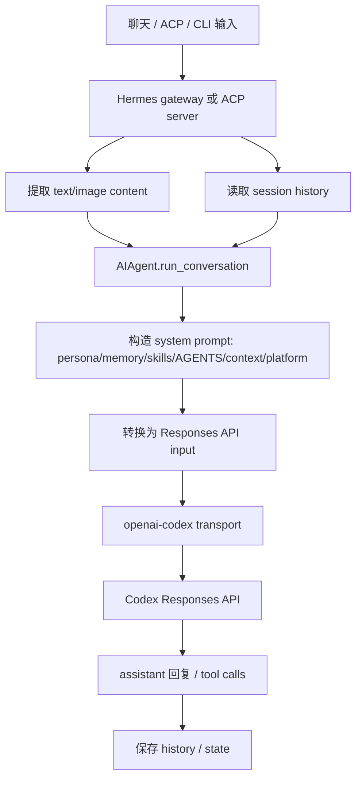
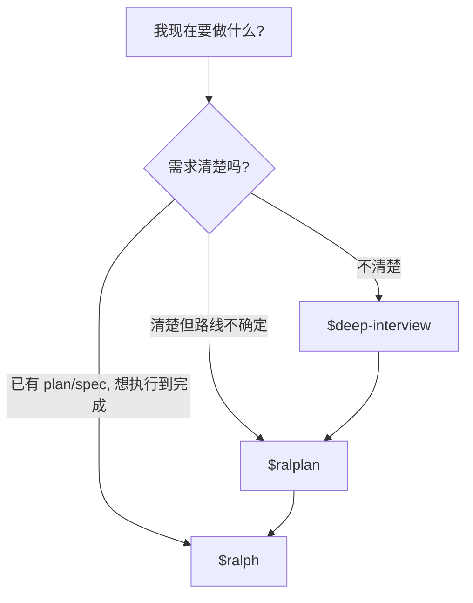
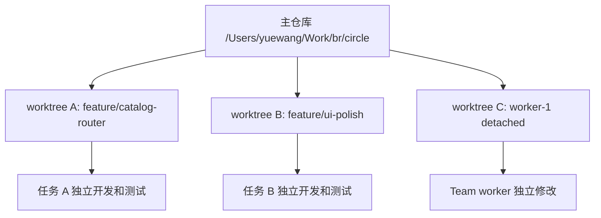
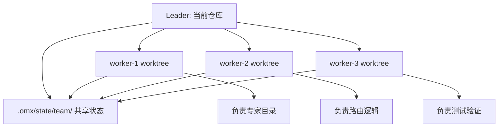

# OMX, Hermes, deep-interview, ralplan, ralph 入门说明

本文记录当前项目里使用 OMX 时需要理解的几个核心概念。这里的 “hernes” 按上下文理解为 Hermes。

## 一句话结论

OMX 不是替代 LLM 的客户端。它是在 Codex 前面加了一层 workflow、skill、state、hook 路由；Hermes 是另一套 agent/gateway runtime，OMX 只通过 adapter 观察或桥接它，不是直接接管 Hermes。

## OMX 如何组织给 LLM 的输入



关键机制：

- `.codex/hooks.json` 会让 Codex 在提交用户 prompt 时调用 OMX 的 native hook。
- OMX 检测到 `$deep-interview`、`$ralplan`、`$ralph` 这类关键词后，会追加一段 `additionalContext`。
- 这段 `additionalContext` 会告诉 Codex 当前应该进入哪个 workflow。
- OMX 同时会把状态写到 `.omx/state/...`。
- 对应的 `SKILL.md` 更像 workflow 契约，告诉 agent 应该如何行动。
- 产物通常写入 `.omx/context`、`.omx/interviews`、`.omx/specs`、`.omx/plans`。

## 三种常用 workflow



### `$deep-interview`

`$deep-interview` 是需求澄清器。它会先读项目上下文，再一轮只问一个问题，用 ambiguity score 判断需求是否清楚。

通过门槛后，它会输出访谈记录和可执行 spec。本项目里的例子：

- `.omx/interviews/roundtable-expert-catalog-20260501T012550Z.md`
- `.omx/specs/deep-interview-roundtable-expert-catalog.md`

适合场景：

- 想做一个功能，但边界还不清楚。
- 目标、非目标、验收标准没有明确。
- 不希望 agent 直接猜需求并开始写代码。

### `$ralplan`

`$ralplan` 是共识计划器，本质是 `$plan --consensus`。

典型流程：



它通常只产出计划，不直接执行。计划里会包含原则、决策驱动、可选方案、推荐方案、风险、验收路径和执行建议。

本项目里的例子：

- `.omx/plans/roundtable-expert-catalog-ralplan-final.md`

适合场景：

- 需求已经比较清楚，但实现路线不确定。
- 需要先比较方案，再决定怎么做。
- 想要一个可交给 `$ralph` 或 `$team` 执行的计划。

### `$ralph`

`$ralph` 是执行闭环。它会基于已有 spec 或 plan 继续做实现、验证、修复、再验证。

典型流程：



适合场景：

- 已经有计划，想让 agent 持续做完。
- 需要实现、测试、修复、再验证形成闭环。
- 用户希望 agent 不停在“建议”，而是执行到可验证完成。

## Hermes 如何组织给 LLM 的输入



Hermes 的大致输入组织方式：

- ACP server 或 gateway 接收用户输入。
- 输入被拆成 text/image content。
- Hermes 读取当前 session history。
- `run_conversation` 构造本轮对话。
- system prompt 会拼入 persona、memory、skills、AGENTS.md、上下文文件、平台信息等。
- provider transport 再把这些内容转成 OpenAI Responses API 的 `instructions` 和 `input`。
- 模型输出后，Hermes 保存 history 和 session state。

本机 Hermes 配置里，默认 provider 是 `openai-codex`，默认模型是 `gpt-5.5`。这说明 Hermes 最终仍然是通过 Codex/OpenAI 侧的模型接口完成推理。

## OMX 和 Hermes 的关系

OMX 的 Hermes adapter 更像观察和桥接层，而不是 Hermes 的主控制器。

它可以做的事情包括：

- 读取 Hermes gateway 状态。
- 观察 Hermes session/runtime 证据。
- 把 OMX 的 lifecycle intent 映射到 Hermes/ACP 语义。
- 在 `.omx/adapters/hermes/` 下写 adapter 相关产物。

它不等于：

- 直接替 Hermes 组织所有 prompt。
- 直接接管 Hermes gateway。
- 直接控制 Hermes 内部的 agent 循环。

## 新手使用建议



推荐顺序：

1. 需求不清楚：先用 `$deep-interview`。
2. 需求清楚但实现路线不确定：用 `$ralplan`。
3. 已有 plan/spec，想让它持续做完并验证：用 `$ralph`。
4. 多人并行大任务才考虑 `$team`。

在这个项目里，比较合理的工作流是：

```text
$deep-interview -> $ralplan -> $ralph
```

这样可以先减少猜测，再形成计划，最后执行和验证。

## 用 worktree 做隔离开发

Git worktree 可以让同一个 Git 仓库同时存在多个工作目录。每个工作目录可以在不同分支上开发，互相不覆盖文件。OMX 在两类场景里会用到它：

1. `omx --worktree` / `omx exec --worktree`：把当前 leader 或一次非交互任务放到独立 worktree。
2. `omx team`：给每个 worker 自动创建独立 worktree，避免多个 worker 同时改同一个目录。

### 为什么要用 worktree

不用 worktree 时，多个 agent 或多个任务都在当前目录改文件，容易出现：

- 未完成改动互相覆盖。
- 一个 agent 的临时修改影响另一个 agent 的测试。
- 很难判断某个改动属于哪个任务。

用 worktree 后，每条任务线有自己的目录、分支和工作区：



### 单人隔离：启动 Codex 到一个 worktree

适合一个较大的功能，不想污染当前主目录。

```bash
# 在当前仓库根目录运行
omx --worktree=feature/catalog-router
```

OMX 会基于当前 `HEAD` 创建一个 Git worktree。对当前项目来说，路径大致会是：

```text
/Users/yuewang/Work/br/circle.omx-worktrees/launch-feature-catalog-router
```

分支名是：

```text
feature/catalog-router
```

之后 Codex 会在这个 worktree 里启动。这个会话里的文件修改不会直接出现在主目录 `/Users/yuewang/Work/br/circle`，而是出现在 `circle.omx-worktrees/launch-feature-catalog-router`。

如果只是临时实验，也可以不指定名字：

```bash
omx --worktree
```

这种模式会创建 detached worktree，通常路径类似：

```text
/Users/yuewang/Work/br/circle.omx-worktrees/launch-detached
```

区别：

- `--worktree=feature/name`：有明确分支，适合真实功能开发。
- `--worktree`：detached，无长期分支名，适合短实验或检查。

### 非交互任务：让 `omx exec` 在 worktree 里跑

如果想让一次非交互任务隔离执行，可以这样：

```bash
omx exec --worktree=feature/add-export-tests "为导出功能补测试，并运行 pnpm test"
```

这类用法适合小而明确的任务。执行完后，到对应 worktree 查看结果：

```bash
cd /Users/yuewang/Work/br/circle.omx-worktrees/launch-feature-add-export-tests
git status
pnpm test
```

确认没问题后，再回主目录合并：

```bash
cd /Users/yuewang/Work/br/circle
git merge feature/add-export-tests
```

### Team 隔离：每个 worker 一个 worktree

`omx team` 当前会在 Git 仓库里默认使用专属 worktree。也就是说，一般不需要再手动加 `--worktree`。

```bash
omx team 3:executor "拆分实现专家目录、路由逻辑和测试验证"
```

典型结构：



worker worktree 通常在当前仓库的 `.omx/team/<team>/worktrees/<worker>` 下，例如：

```text
/Users/yuewang/Work/br/circle/.omx/team/<team>/worktrees/worker-1
/Users/yuewang/Work/br/circle/.omx/team/<team>/worktrees/worker-2
```

注意：`omx team` 是 tmux runtime。需要从 tmux 里的 OMX/Codex session 启动；在 Codex App 或普通非 tmux shell 里，直接启动 team 通常会失败。

### 使用前检查

启动 worktree 前，建议先看当前状态：

```bash
git status --short
git worktree list
```

对 `omx team` 尤其重要：team 默认给 worker 建 worktree，并要求 leader 工作区干净。如果当前目录已经有未提交或未暂存改动，应先选择一种处理方式：

```bash
# 方案 A：提交当前进度
git add <files>
git commit -m "save current progress before team worktrees"

# 方案 B：临时存起来
git stash push -u -m "before omx team worktrees"
```

当前项目经常会有 `.omx/`、`node_modules/`、`dist/` 等运行产物。它们应该继续留在 `.gitignore` 里，不要为了启动 worktree 把这些产物提交进去。

### 查看和清理 worktree

查看已有 worktree：

```bash
git worktree list
```

进入某个 worktree 查看改动：

```bash
cd /Users/yuewang/Work/br/circle.omx-worktrees/launch-feature-catalog-router
git status
git diff
```

合并完成后，如果确认不再需要这个 worktree，可以清理：

```bash
cd /Users/yuewang/Work/br/circle
git worktree remove /Users/yuewang/Work/br/circle.omx-worktrees/launch-feature-catalog-router
```

如果这个分支已经合并且不再需要，再删除分支：

```bash
git branch -d feature/catalog-router
```

不要在没有确认改动已合并或已保存前删除 worktree。worktree 是隔离开发目录，里面可能有唯一的一份未提交修改。

### 推荐实践

- 做真实功能：用 `omx --worktree=feature/<name>`，保留清晰分支。
- 做短实验：用 `omx --worktree`，结束后确认是否保留。
- 做多人/多 lane 并行：用 `omx team`，让 worker 自动隔离。
- 合并前：在对应 worktree 里跑 `pnpm test`、`pnpm build` 或项目要求的验证命令。
- 合并后：回主目录再次跑验证，确认集成后的结果没被分支隔离掩盖。
